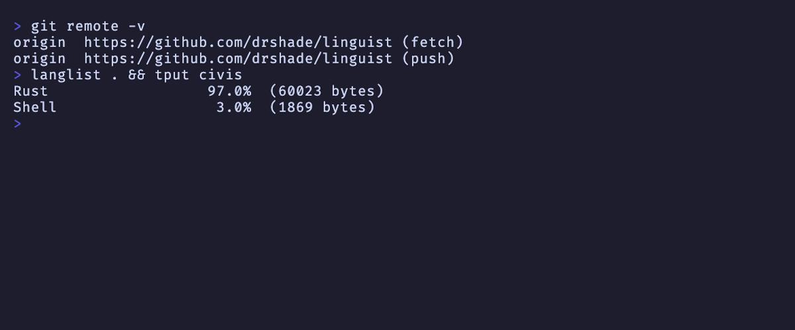

# langlist

Repo-wide language breakdown by byte count, like GitHub's "Languages" bar.

## Usage

```
langlist [--json] [root-dir]
```

Defaults to the current directory. Requires the target to be a git repo (uses `git ls-files` to find tracked files). Pass `--json` for machine-readable output.

```text
$ langlist ~/Dev/Clones/linguist
Rust                  97.0%  (60023 bytes)
Shell                  3.0%  (1869 bytes)
```

## Screenshot



## Build

```
cargo build --release
```
